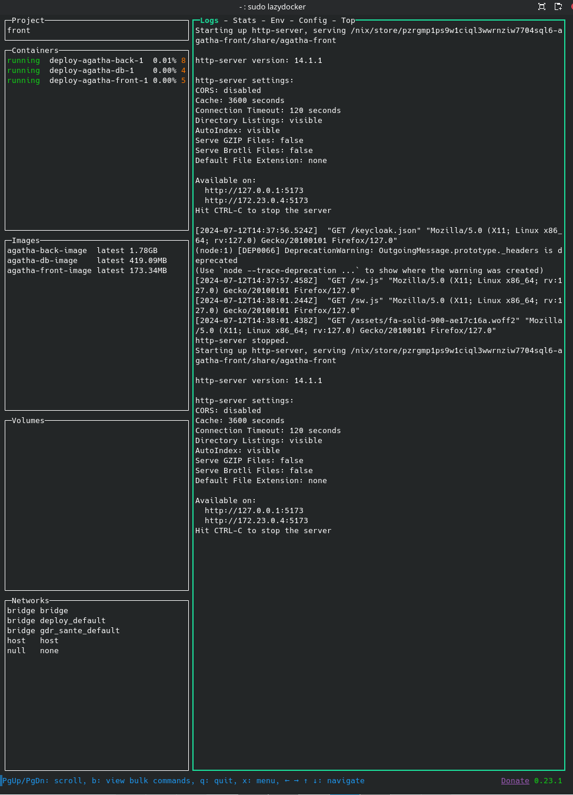

## Why 

As a nix user myself, I wanted to create a deployment sytem that could be derived both as a nix package (my end goal for personal use) and as a set of docker images (for production use). 
Being used to working in a reproducible environment with a nix-shell but aware that Docker was the industry standard, I did some research on the complementarity of both tools. 

- Docker ensures a consistant runtime environment. Once the image is built, you're good to go. But if you need to rebuild it, you don't have any guarantee you will be able to recreate it.
- Nix on the other hand ensures a reproducible build. No matter when you retrieve the source, if you rebuilt it you will have the exact same result.

Is Docker still relevant then ? (was it worth it for me to learn it ? was my main question at first)
Docker has a formidable deployment ecosystem that ensure you can easily deploy your application anywhere. Moreover, most developer are used to using it and will be glad to keep a familiar setup 

## How ?

### A) Creating a Docker image for my Kotlin backend

#### 1) Creating a nix package

There seems to be multiple approach, one where you start from your raw code source (see Gradle2Nix) and one where you start with the jar. 
I decided to keep it simple for now and went with the jar option.

```nix title="back/deploy/back.nix"
let
  pkgs = import <nixpkgs> {};
in

{
# Import all the required library and only those. 
stdenv ? pkgs.stdenv,
fetchurl ? pkgs.fetchurl,
makeWrapper ? pkgs.makeWrapper,
jre ? pkgs.temurin-jre-bin-17,
}:

# Create a derivation (aka, recipe to create the package)
stdenv.mkDerivation rec {
  name = "agatha-back";
  version = "2.4";

  # the src files/folders will be accessible in the install Phase of your package
  # here, I took the jar and the associated database migration folder 
  src = [
    ../build/libs/tresorier-backend-uber.jar
    ../src/main/resources/db/pg
  ];
  dontUnpack = true; 

  nativeBuildInputs = [ makeWrapper ];

  # the cp put the jar and migrations in /share/agatha  
  # the makeWrapper define a /bin/agatha-back executable
  # that will run the jar with the given options 
  installPhase = ''
    mkdir -pv $out/share/agatha $out/bin
    cp $src[0] $out/share/agatha/${name}-${version}.jar
    cp $src[1] $out/share/agatha/migrations 
    makeWrapper ${jre}/bin/java $out/bin/agatha-back \
      --add-flags "-Dlogback.configurationFile=logback.xml" \
      --add-flags "-jar $out/share/agatha/${name}-${version}.jar" \
      --set _JAVA_OPTIONS '-Dawt.useSystemAAFontSettings=on' \
      --set _JAVA_AWT_WM_NONREPARENTING 1
  '';
}
```

I can now create a nix package by running 
```sh
nix-build back.nix
``` 

<details>

<summary>See the console output</summary>

```sh 
[erica@xiangu:~/_Agatha/code/app/back/deploy]$ nix-build back.nix 
this derivation will be built:
  /nix/store/aklgkqvn80v6c8iglwyk3chc25l89rrs-agatha-back.drv
building '/nix/store/aklgkqvn80v6c8iglwyk3chc25l89rrs-agatha-back.drv'...
Running phase: patchPhase
Running phase: updateAutotoolsGnuConfigScriptsPhase
Running phase: configurePhase
no configure script, doing nothing
Running phase: buildPhase
no Makefile or custom buildPhase, doing nothing
Running phase: installPhase
mkdir: created directory '/nix/store/nl3215hyl2bnyfsgbwsjryfg682dym1a-agatha-back'
mkdir: created directory '/nix/store/nl3215hyl2bnyfsgbwsjryfg682dym1a-agatha-back/share'
mkdir: created directory '/nix/store/nl3215hyl2bnyfsgbwsjryfg682dym1a-agatha-back/share/agatha'
mkdir: created directory '/nix/store/nl3215hyl2bnyfsgbwsjryfg682dym1a-agatha-back/bin'
Running phase: fixupPhase
shrinking RPATHs of ELF executables and libraries in /nix/store/nl3215hyl2bnyfsgbwsjryfg682dym1a-agatha-back
checking for references to /build/ in /nix/store/nl3215hyl2bnyfsgbwsjryfg682dym1a-agatha-back...
patching script interpreter paths in /nix/store/nl3215hyl2bnyfsgbwsjryfg682dym1a-agatha-back
stripping (with command strip and flags -S -p) in  /nix/store/nl3215hyl2bnyfsgbwsjryfg682dym1a-agatha-back/bin
/nix/store/nl3215hyl2bnyfsgbwsjryfg682dym1a-agatha-back
```

</details>


The package is stored by default in my nix store, I can call it using 
```sh
# replace with the correct hash given by the output of the build
/nix/store/q47aidmp4akf08ipmqr7xxyd5gdc8kdq-agatha-back/bin/agatha-back
```

*the hash is the signature of the package, being reproducible it will always be the same given the same input but any changes (to the config or the jar for exemple) will result in a distinct hash so that both version of the package can co-exist peacefully*

The build command will also create a symlink locally in a result folder. I can call it using 
```sh
./result/bin/agatha-back
``` 
and here we are, my package is running !

#### 2) Creating a docker image

I now want to wrap my package in a docker container. Again, there are multiple ways to do it.

You could go with a classic Dockerfile but I wanted to experiment with a full nix option (besides, I had read that [Nix is a better Docker image builder than Docker's image builder, by Xe](https://xeiaso.net/talks/2024/nix-docker-build/) which made me want to try)

It isn't well referenced but my main source of information was the official [nixpkgs documentation for DockerTools](https://nixos.org/manual/nixpkgs/stable/#sec-pkgs-dockerTools)

So here we are :

```nix title="back/deploy/back-docker.nix"
# Define all the required libraries and give a default value for each
{ 
  pkgs ? import <nixpkgs> { system = builtins.currentSystem; },
  dockerTools ? pkgs.dockerTools,
  agatha-back  ? pkgs.callPackage ./back.nix { },
  flyway ? pkgs.flyway,
  bash ? pkgs.bash,
}:
dockerTools.buildLayeredImage {
  name = "agatha-back-image";
  tag = "latest";

  contents = [ agatha-back flyway bash];

  extraCommands = ''
    mkdir -p home
  '';

  config = { 
    ## this commands runs first the migrations on the database, then the jar
    ## for easier configuration, both flyway.conf and gradle.properties will be shared with the container later on
    Cmd = [ "/bin/bash" "-c" "/bin/flyway -configFiles=/home/flyway.conf migrate && /bin/agatha-back" ];
    WorkingDir = "/home";
  };
}
```

You can now build the image and load it 

```sh
nix-build deploy/back-docker.nix 
docker load < result
```


### B) Creating a Docker image for the database

*(optional, you could just use any database)*


```nix title="back/deploy/db-docker.nix"
{ 
  pkgs ? import <nixpkgs> { system = builtins.currentSystem; },
  dockerTools ? pkgs.dockerTools,
}:
dockerTools.pullImage {
  imageName = "postgres";
  imageDigest = "sha256:afcb675cf038e3fc006fe515d407a79dc8e1f829f671dd25b176a8d823be1e7c"; # found in the image page just under the title : https://hub.docker.com/layers/library/postgres/13.15/images/sha256-c07edc26368f1c68093cc9247cc8daa38199e7a78a4fcc2879eef533388ef22c?context=explore
  finalImageName = "agatha-db-image";
  finalImageTag = "latest";
  # start by setting any value to the sha256 string, after the first build, you will receive the signature of the 
  sha256 = "sha256-+wzNtWHS+ZwpKCVJZSNE5gVxzErgBOB1LOSesggVTA0=";
}
```

Again, build the image and load it 

```sh
nix-build deploy/db-docker.nix 
docker load < result
```

### C) Creating a Docker image for my Vue front-end

#### 1) Creating a nix package

```nix title="front/deploy/front.nix"
let
  pkgs = import <nixpkgs> {};
in

{would take a small hatchback 6 days of doing the same journey every day to damage the road as much as one journey in a small suv.
# can be overridden with `yourPackage.override { enableSomething = true; }`
  stdenv ? pkgs.stdenv,
  makeWrapper ? pkgs.makeWrapper,
  http-server ? pkgs.http-server
}:

stdenv.mkDerivation rec {
  name = "agatha-front";
  version = "2.4";

  src = ../dist;

  nativeBuildInputs = [ makeWrapper];
  buildInputs = [ ];

  # the makeWrapper define a /bin/agatha-front executable
  # that will serve the /share/agatha-front on port 5273 with a simple http-server 
  installPhase = ''
    mkdir -p $out/share
    cp -a . $out/share/agatha-front
    makeWrapper ${http-server}/bin/http-server $out/bin/agatha-front \
      --add-flags "$out/share/agatha-front" \
      --add-flags "-p" \
      --add-flags "5173"
  '';
}
```

As before, I went with the easy route of just wrapping the build project inside a nix package
Again, I can run it as a standalone : 

```sh
[erica@xiangu:~/_Agatha/code/app/front/deploy]$ nix-build front.nix 
/nix/store/pzrgmp1ps9w1ciql3wwrnziw7704sql6-agatha-front

[erica@xiangu:~/_Agatha/code/app/front/deploy]$ ./result/bin/agatha-front 
Starting up http-server, serving /nix/store/pzrgmp1ps9w1ciql3wwrnziw7704sql6-agatha-front/share/agatha-front

http-server version: 14.1.1

http-server settings: 
CORS: disabled
Cache: 3600 seconds
Connection Timeout: 120 seconds
Directory Listings: visible
AutoIndex: visible
Serve GZIP Files: false
Serve Brotli Files: false
Default File Extension: none

Available on:
  http://127.0.0.1:5173
  http://192.168.1.65:5173
Hit CTRL-C to stop the server
```


#### 2) Creating a docker image

```nix title="front/deploy/front-docker.nix"
{ 
  pkgs ? import <nixpkgs> { system = builtins.currentSystem; },
  dockerTools ? pkgs.dockerTools,
  agatha-front  ? pkgs.callPackage ./front.nix { },
}:
dockerTools.buildLayeredImage {
  name = "agatha-front-image";
  tag = "latest";

  contents = [ agatha-front];

  config = {
    Cmd = [ "/bin/agatha-front" ];
  };
}
```

The docker container only needs to run the command and bim we're done

```sh
nix-build deploy/front-docker.nix 
docker load < result
```

### D) Running them all together

I then use docker-compose to start them all so that they can communicate with each other

```yaml title="deploy/compose.yaml"
services:
  agatha-db:
    image: agatha-db-image:latest
    environment:
      POSTGRES_PASSWORD: agatha-db-password
      POSTGRES_USER: postgres
      POSTGRES_DB: docker_agatha_db
    ports:
      - 4321:5432    #HOST:CONTAINER
    volumes:
      - ./db_data:/var/lib/postgresql/data

  agatha-back:
    image: agatha-back-image:latest
    ports:
      - 8000:8000
    volumes:
      - type: bind
        source: gradle.properties
        target: /home/gradle.properties
      - type: bind
        source: flyway.conf
        target: /home/flyway.conf
    depends_on:
      - agatha-db

  agatha-front:
    image: agatha-front-image:latest
    ports:
      - 5173:5173
    depends_on:
      - agatha-back
```

Note on the port, I opened a port to each container to allow independant access, but a member of the same network create by docker compose, they can adress each other trough any port using their name as the host (ex: agatha-db:5432, agatha-back:8000)

For example, the configuration file used by the backend to contact the database is like so :

```conf title="flyway.conf"
flyway.driver=org.postgresql.Driver
flyway.url=jdbc:postgresql://agatha-db:5432/docker_agatha_db <- 
flyway.user=postgres
flyway.password=agatha-db-password
flyway.locations=filesystem:/share/agatha-migrations
```

Note I call the original port 5432, used by the service, not 4321 wich is the redirection I gave it in the docker compose

I now run :

```sh
docker compose up -d
```

and can see the result using [lazydocker](https://github.com/jesseduffield/lazydocker) :




### E) Final note

Everything is working smoothly and once I found the relevant tools, the code seems quite straight forward to improve and maintain.
I used [dive](https://github.com/wagoodman/dive) to check on the images efficiency :

- agatha-back : 
  - Total Image size: 1.8GB  <= why java ??
  - Potential wasted space: 0 B 
  - Image efficiency score: 100 %

- agatha-front :
  - Total Image size: 173 MB
  - Potential wasted space: 0 B
  - Image efficiency score: 100 %  

- agatha-db : 
  - Total Image size: 419 MB
  - Potential wasted space: 8.3 MB 
  - Image efficiency score: 98 %  <= ironically the official image is the one with wasted space

I woudl like to improve it a bit in the future : 
- reduce the size of the java image (maybe by using a smaller jre)
- take the migration process out of the docker image and in the nix package itself

but still, **Mission accomplished**.
