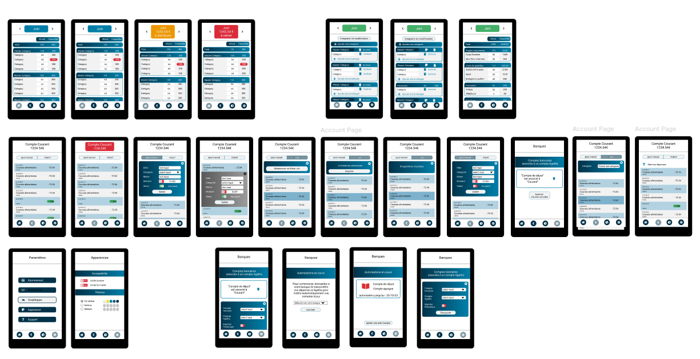
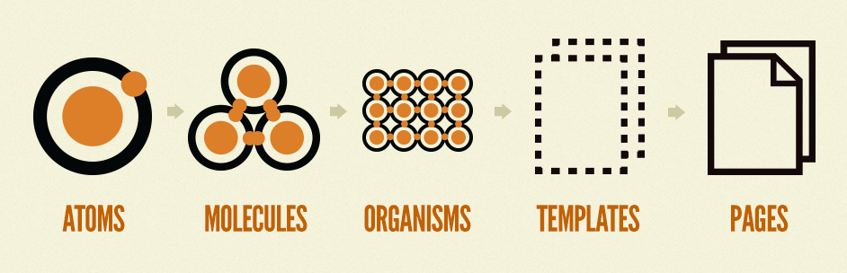
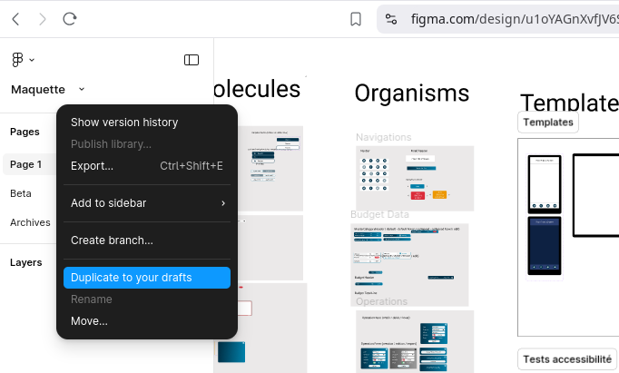

You want to know more about the way we design the interface ? 

Welcome to the wonderful world of Figma.

All the mock-ups for Agatha are available publicly [here](https://www.figma.com/design/u1oYAGnXvfJV6SmSyJc0EO/Maquette?node-id=0-1&p=f)

We use the [Atomic Design Principles](https://atomicdesign.bradfrost.com/chapter-2/) to create a cohesive design system.

If you create a figma account, you can then clone the mockup to your own draft and experiment with it. 

Don't hesitate to send us your suggestions !
