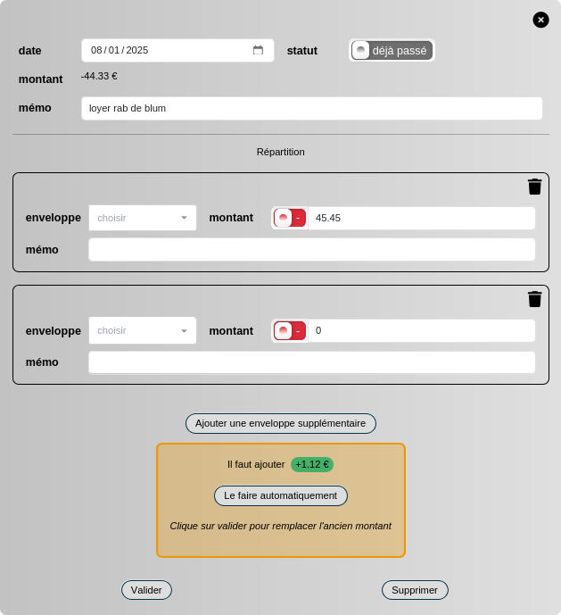

## A dev diary 

### 09/01/2025

Almost there ! There was some remaining complexity with the new server (a matter of database connection being closed by the firewall) but the fix is up and seems to hold. 

The migration is near ! 

I have at least been able to work on the feature side of the app after so long buried in the sysadmin. m
Here is the new version of the enveloppe subdivision ! 
Better text and a button to automatically create a enveloppe with the required amount :)

It was so deliciously easy to be back on the dev ground, I look forward to the next feature (should be the handling of accents)

